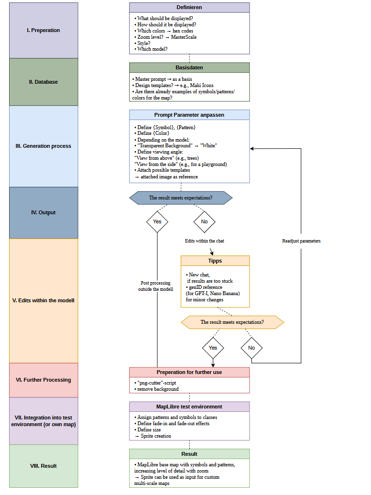
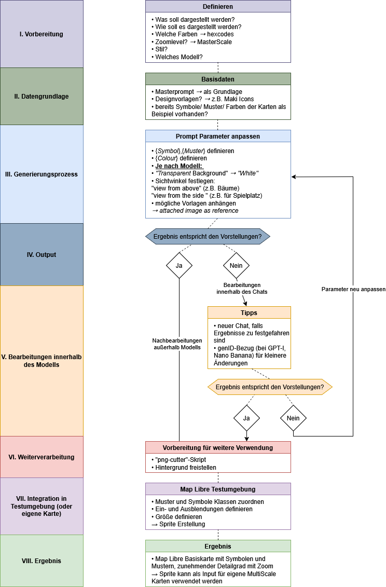
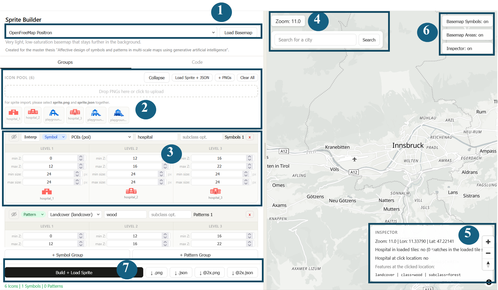

# Sprite Builder🗺️
Worklfow to generate symbols and patterns for multi-scale maps with AI.

This repository contains the MapLibre-based multi-scale test environment and supporting workflow used in the master thesis🎓:

*"Affective Design of Symbols and Patterns with Generative Artificial Intelligence"* at the university of vienna.

## Workflow

English workflow:



German workflow:



You can also open the workflow files directly:

- [`workflow/workflow_en.png`](./workflow/workflow_en.png)
- [`workflow/workflow_de.png`](./workflow/workflow_de.png)

## Run locally

Start the local server inside this folder:

```powershell
node .\sprite_builder_server.js
```

Then open:

- `http://localhost:8080/`

Do not open the HTML file directly with `file://`, because the app depends on the local server for:

- `style.json`
- sprite import and export endpoints
- generated sprite files
- local GeoJSON test data

## Sprite Builder UI

The following figure shows the numbered user interface of the Sprite Builder:



In the environment you can:

- choose an open basemap style such as OpenFreeMap / MapLibre-based styles `(1)`
- upload PNG symbols and patterns to the icon pool `(2)`
- assign them to symbol, pattern, line pattern, and forest edge groups `(3)`
- search for places and navigate within the map `(4)`
- inspect classes and subclasses in the map `(5)`
- compare generated results with native basemap symbols and areas `(6)`
- build `sprite.png` and `sprite.json` `(7)`
- re-import an existing sprite bundle
- define zoom ranges and pixel sizes
- test symbol and pattern transitions across zoom levels

## Project notes

- The Sprite Builder scripts were developed with support from Codex.
- The test environment uses MapLibre GL JS together with OpenFreeMap basemap styles and related vector map data.
- Third-party license notes for reused code are documented in [`THIRD_PARTY_LICENSES.md`](./THIRD_PARTY_LICENSES.md).

## Folder structure

- [`sprite_builder_map_libre.html`](./sprite_builder_map_libre.html)
  Main MapLibre-based test environment
- [`sprite_builder_server.js`](./sprite_builder_server.js)
  Local Node server for the app, style, sprite endpoints, and local data
- [`style.json`](./style.json)
  Basemap style used by the app
- [`workflow`](./workflow)
  Workflow graphics for the thesis in German and English
- [`generative_ai_assets`](./generative_ai_assets)
  Source symbols and patterns created with generative AI before sprite export
- [`generative_ai_assets/examples`](./generative_ai_assets/examples)
  Example symbols and patterns shared as source material
- [`generated_sprite`](./generated_sprite)
  Local writable output folder for newly generated sprite bundles
- [`shared_sprites/examples`](./shared_sprites/examples)
  Curated example sprite bundles
- [`shared_sprites/community_uploads`](./shared_sprites/community_uploads)
  User-contributed sprite bundles


## There are two Masterprompts, which are helpful for generating multiscale map symbols and patterns 

### For symbols:
```
Create a professional cartography sprite sheet, three variations of a {symbol} symbol for different zoom levels.
[Left]: ultra minimalist flat icon, show recognizable form. No details, one colour.
[Center]: stylized flat vector, with a little more details, dont add details of the surroundings.
[Right]: more detailed symbol with shading.
All three symbols should have clean lines, consistent {(colour)} colour palette, flat design. {Transparent} background. Be self-explanatory and generic map icons, dont make large outline changes.
Use the same style and colours, but increase in detail so if they are later put above each other there should be a smooth transition between the unique symbols.
Important: size ratio should be 1, 1.5, 2.25
No text.
```

### For patterns:
```
Create a professional cartography sprite sheet, three variations of a {pattern} pattern for different zoom levels.
[Left]: ultra minimalist colour field {hex #}. No details, one colour, no text.
[Center]: stylized flat forms, with a little more details, dont add details of the surroundings
[Right]: more detailed pattern with shading.
All three patterns should have clean lines, consistent colour palette {(hex #)}, flat design. {Transparent} background. Be self-explanatory and generic, minimalistic pattern, dont make large outline changes.
Use the same style and colours, but increase in detail so if they are later put above each other, there should be a smooth transition between the unique pattern elements. Make it (seamless tiles) in every direction.
Important: size ratio should be 1, 1.5, 2.25. Format 1:1 for the three patterns.
No text, no numbers.
```

## Important note

Files in `generated_sprite` are local working output. If you want to share a finished sprite bundle, copy it into:

- `shared_sprites/examples`
- `shared_sprites/community_uploads`
